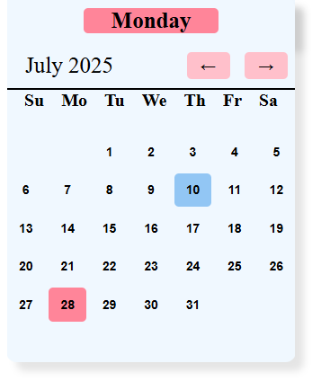

Title:
Interactive Monthly Calendar with Navigation

Description:
A simple JavaScript-based interactive calendar that displays the current month with clickable day cells. Users can navigate between months using "Back" and "Go" buttons. 
The calendar highlights the current day and dynamically updates the displayed month and year. Perfect for learning DOM manipulation, date handling, and event-driven UI updates.

